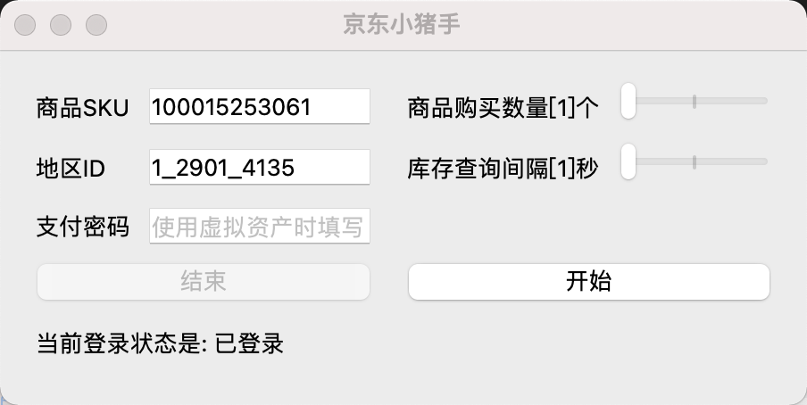

<div id="top"></div>

<h1 align="center">


</h1>


<!-- PROJECT LOGO -->
<br />
<div align="center">
  <a href="https://github.com/PlayCover/PlayCover">
    
  </a>

  <h3 align="center">Jd小猪手</h3>

  <p align="center">
    一款支持京东自动下单的小工具。
    <br />
    <br />
  </p>
</div>

## 1 关于项目

欢迎使用京东小猪手，当您在京东上想要购买的商品无货时，小助手可以帮助您全天候监听商品库存，并在有货时第一时间自动尝试下单，且下单成功后支持微信通知触达。



📢**注意**：由于货源有限，监听到货源后并不能保证一定下单成功，只能保证让你和全国黄牛站在同一起跑线上，剩下的交给奇迹。

### 1.1 ChangeList

- 2022-10-29

1. 新增预售商品定金下单模式
2. 切换库存查询方式（注意控制速度）

## 2 食用教程

目前该项目支持两种 **Shell 脚本** 和 **GUI 图形界面** 两种运行模式，目前 Shell 模式支持日志和微信通知，但还需一些额外配置，可根据自身条件选择启动方式。

### 2.1 Shell 脚本

1. 安装运行环境

- [Python](https://www.python.org/)

2. 安装第三方库

``` shell
pip install -r requirements.txt
# or 
pip3 install -r requirements.txt
```

3. 修改配置

进入项目目录，找到 `config.ini` 文件，按照其中说明修改对于配置。

4. 运行脚本

修改项目主文件 `JdBuyer.py` 最后部分中 `skuId` 和 `areaId`。
*其余参数字请按注释自行选择修改*

然后运行程序：
``` python 
python JdBuyer.py
# or
python JdBuyer.py
```

### 2.2 GUI 图形界面

目前可支持 windows 和 macos，请到 [release](https://github.com/zas023/JdBuyer/releases) 下载对于文件：

- windwos 下载 JdBuyerApp.zip，解压后双击运行其中可执行文件即可；

- macos 下载 JdBuyerApp.app，下载后直接双击运行即可。

**1. 如何配置**

运行程序后，可以看到一共有一下五个配置：

|参数名称|是否必填|说明|
|--|--|--|
|商品SKU|是|京东商品详情页链接中可以找到,<br>如 https://item.jd.com/100015253061.html|
|地区ID|是|下单地址所在的地区,<br>可以在工程 [area_id](./area_id) 文件夹中找到|
|购买商品数量|是|默认1|
|库存查询间隔|是|监听库存的时间间隔，默认3秒|
|支付密码|否|如需使用虚拟资产，如京豆、E卡等|

*注：所有配置均只会保存本地。*

**2. 如何运行**

当完成以上配置后，点击【开始】按钮即可，如果当前是未登陆状态，会自动弹出登陆二维码等待你打开京东APP扫码登录，登陆成功后会自动开始执行任务。

*注：如长时间未登录提示二维码过期，点击【结束】按钮，重新【开始】即可。*

### 2.3 视频教程

[B站传送门，记得一键三连哦！](https://www.bilibili.com/video/BV1pe4y1e7ty)

## 3 Todo
- [x] 支持扫码登陆
- [ ] 登陆状态保活
- [x] 开发图形界面

# 免责声明

本项目所用资源均源自网络，如有侵犯您的权益，请来信告知，将立即予以处理。

任何以任何方式查看此项目的人或直接或间接使用该项目任何使用者都应仔细阅读此声明。一旦使用并复制了任何相关脚本或Script项目的规则，则视为您已接受此免责声明。

您必须在下载后的24小时内从计算机或手机中完全删除以上内容。

